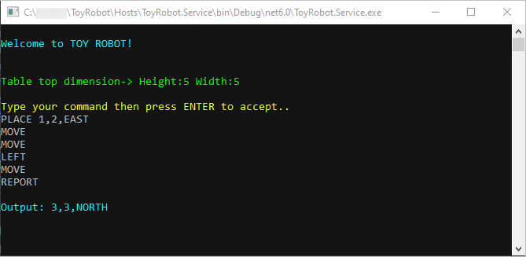
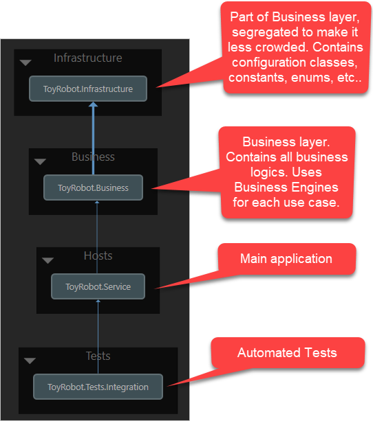

# Table of contents 

<!-- TOC -->

- [Introduction](#introduction)
	- [Solution overview](#solution-overview)
		- [Business Layer](#business-layer)
			- [Business Engines](#business-engines)
		- [Project dependency diagram](#project-dependency-diagram)
- [Getting Started](#getting-started)
	- [Prerequisites](#prerequisites)
	- [Local Setup](#local-setup)
		- [Setup your local machine](#setup-your-local-machine)
		- [Configure table size](#configure-table-size)
	- [How to use the application](#how-to-use-the-application)
		- [PLACE](#place)
		- [MOVE](#move)
		- [LEFT](#left)
		- [RIGHT](#right)
		- [REPORT](#report)
		- [Example Input and Output](#example-input-and-output)
	- [How to exit the application](#how-to-exit-the-application)
- [Automated tests](#automated-tests)
	- [Integration tests](#integration-tests)
- [Logging](#logging)

<!-- /TOC -->
# Introduction 

The application is a simulation of a toy robot moving on a square table top, of dimensions 5 units x 5 units. There are no
other obstructions on the table surface. The robot is free to roam around the surface of the table, but must be prevented
from falling to destruction. Any movement that would result in the robot falling from the table must be prevented,
however further valid movement commands must still be allowed.

  * Below is the console app in action:

	

	:house: [TOC](#table-of-contents)


## Solution overview

### Business Layer

* Consists of Business Engines, the code representation of specific Business-use-cases. These are highly testable chunk of codes.
 

#### Business Engines

* Business Engine is the core of the application. This is where all the business cases are handled. 

* These are highly testable chunk of codes.

* When creating new business engines, each engine should only do one thing and should do it very well.

	:house: [TOC](#table-of-contents)

### Project dependency diagram

> 
 
> :house: [TOC](#table-of-contents)

---

# Getting Started

* The solution is built using Visual Studio 2022 with .Net6.

## Prerequisites

1. Visual Studio 2022 latest update.
2. [.NET 6.0](https://dotnet.microsoft.com/download/dotnet)

	:house: [TOC](#table-of-contents)

---

## Local Setup

### Setup your local machine

* Open the solution using Visual Studio 2022 then press F5 to run.

	[ToyRobot.sln](ToyRobot.sln)
  
  
	:house: [TOC](#table-of-contents)
	
---
### Configure table size

* Open [appsettings.json](Hosts/ToyRobot.Service/appsettings.json) and change the table size.
	
	```json
	"TableDimension": {
		"Height": 5,
		"Width": 5
	}
	```

	:house: [TOC](#table-of-contents)
	
---

## How to use the application

This console aplication accepts the following commands:

### PLACE

* PLACE will put the toy robot on the table in position X,Y and facing NORTH, SOUTH, EAST or WEST. 
* The origin (0,0) can be considered to be the SOUTH WEST most corner. 
* It is required that the first command to the robot is a PLACE command, after that, any sequence of commands may be issued, in any order, including another PLACE command.
* The application will discard all commands in the sequence until a valid PLACE command has been executed.

* Example:

	:information_source: This will place the robot in the 1,1 coordinates facing NORTH.

	```bash
	PLACE 1,1,NORTH
	```

### MOVE

* MOVE will move the toy robot one unit forward in the direction it is currently facing.

### LEFT

* LEFT will rotate the robot 90 degrees to the left (counter clockwise) without changing the position of the robot.

### RIGHT

* RIGHT will rotate the robot 90 degrees to the right (clockwise) without changing the position of the robot.

### REPORT

* REPORT will announce the X,Y and F of the robot.


### Example Input and Output

* Press ENTER to accept each commands.

	```
	a)----------------
	PLACE 0,0,NORTH
	MOVE
	REPORT
	Output: 0,1,NORTH

	b)----------------
	PLACE 0,0,NORTH
	LEFT
	REPORT
	Output: 0,0,WEST

	c)----------------
	PLACE 1,2,EAST
	MOVE
	MOVE
	LEFT
	MOVE
	REPORT
	Output: 3,3,NORTH
	```

	:house: [TOC](#table-of-contents)

---

## How to exit the application

* You can exit the application by pressing **CTRL+C**.


	:house: [TOC](#table-of-contents)

---

# Automated tests

## Integration tests

* This app uses [xunit](https://github.com/xunit/xunit).


1. Using the command line, navigate to **Tests\ToyRobot.Tests.Integration** folder
2. Run:

	```bash
	dotnet test
	```
  
	:house: [TOC](#table-of-contents)

---

# Logging

* This app uses [NLog](https://nlog-project.org/).

---

> :house: Goto [Table of contents](#table-of-contents)

